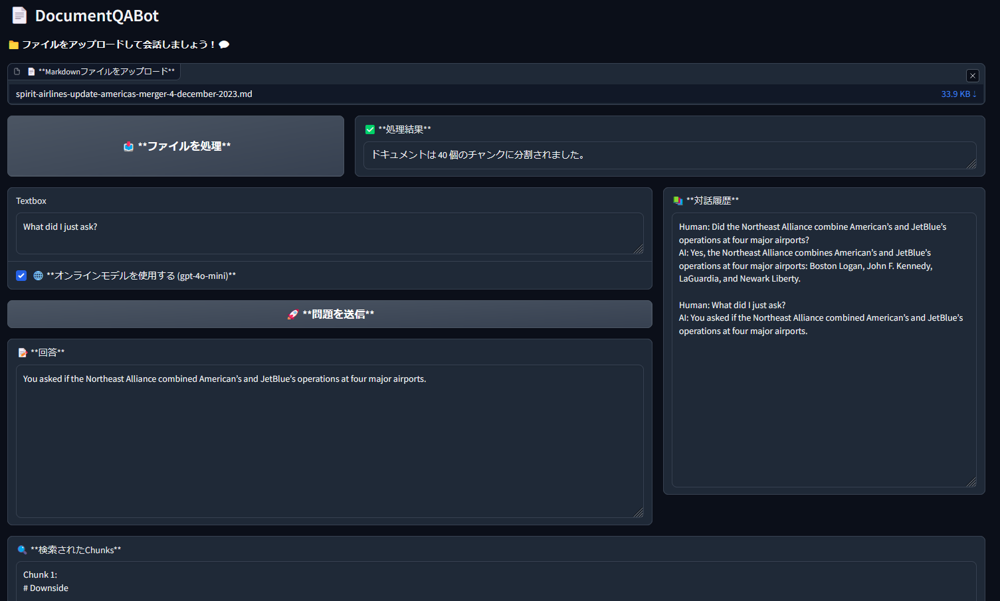

# Document QA Bot

# 📄 DocumentQABot

## Project Overview 🧾

**DocumentQABot** is a system that allows users to engage in a Q&A conversation based on the content of an uploaded Markdown file. The system is built using `langchain` and `Gradio`, supporting both online and local language models. Users can upload a file, and the system will automatically parse and split the document into searchable chunks, using an embedding model to create a vector store that facilitates context-based answers.

Key features include:
- **File Upload and Processing**: Users can upload Markdown files, and the system will process and split the content into searchable chunks.
- **Q&A Functionality**: The system provides context-based answers to user questions based on the uploaded document, supporting both local and online models.
- **Conversation History**: The system keeps a record of recent conversations, allowing users to view previous interactions.
- **Gradio Interface**: A user-friendly web interface built with Gradio, making it easy to upload files and input questions.

## Functionality Overview 💡

1. **File Upload and Processing**:
   - Users upload a Markdown file, and the system reads and splits the content.
   - The document is split using the `CharacterTextSplitter` from `langchain`, generating searchable chunks of content.
   - After splitting, the document is embedded into vector space for retrieval during the Q&A process.

2. **Q&A Functionality**:
   - Users input questions, and the system generates answers based on the document content and context.
   - Two modes are available for generating answers:
     - **Online Mode**: Using `ChatOpenAI` and the `gpt-4o-mini` model.
     - **Local Mode**: Using the custom Ollama model (e.g., `Llama-3-ELYZA-JP-8B`).
   - The system retrieves relevant document chunks to provide context for answering questions.

3. **Vector Store**:
   - The document content is embedded using `HuggingFace`'s `sentence-transformers/all-MiniLM-L6-v2` model and stored in a `FAISS` vector store for efficient retrieval.

4. **Conversation History**:
   - The system maintains a conversation history, keeping track of the last 10 exchanges to provide context for ongoing interactions.

5. **Web UI**:
   - The web interface is built using `Gradio`, allowing users to easily upload files, input questions, and interact with the system.
   - The UI is simple and intuitive, with sections for file upload, question input, answer display, conversation history, and retrieved document chunks.

## Technologies Used 🛠️

- **LangChain**: For document processing, splitting, embedding, and retrieval functionality, supporting the creation of a Q&A chain (RetrievalQA).
- **HuggingFace Embeddings**: To embed document content into vector space for efficient retrieval.
- **FAISS**: Used to store and quickly retrieve embedded document vectors.
- **OpenAI GPT-4o-mini**: Used as the online language model for Q&A processing.
- **Ollama Local Model**: Supports localized question-answer processing (e.g., `Llama-3-ELYZA-JP-8B` model).
- **Gradio**: For building a user-friendly web interface that enables easy interaction with the system.

## How to Use 📋

1. **Install Dependencies**:
   Ensure that you have installed the required Python libraries. You can install them by running:
   


## Installation
1. Clone the repository:
   ```bash
   git clone <repository-url>
   cd <repository-directory>
   ```

2. Install the required packages:
   ```bash
   pip install -r requirements.txt
   ```

3. Ensure you have the necessary API keys for the language models.

## Usage
1. Run the application:
   ```bash
   python document_qa_bot.py
   ```

2. Open your web browser and navigate to `http://localhost:7860`.

3. Upload a Markdown file using the provided interface.

4. Enter your question in the input box and select whether to use the online model.

5. Click the submit button to receive answers and view the conversation history.

## Contributing
Contributions are welcome! Please submit a pull request or open an issue for any enhancements or bug fixes.
